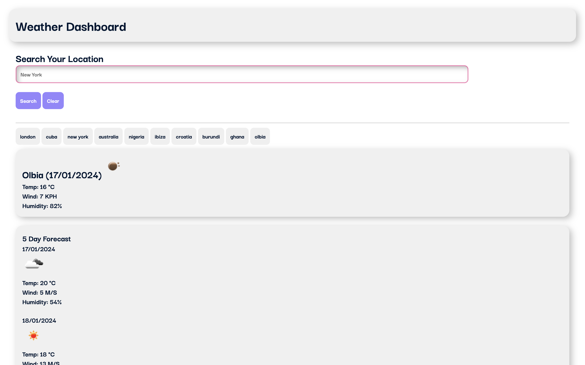

# APIs-Weather-Dashboard
5 Day Weather Forecast API - To retrieve weather data for cities.

https://dami-ani.github.io/APIs-Weather-Dashboard/

## User Story
```md
AS A traveler
I WANT to see the weather outlook for multiple cities
SO THAT I can plan a trip accordingly
```

## Acceptance Criteria

- Create a weather dashboard with form inputs.
  - When a user searches for a city they are presented with current and future conditions for that city and that city is added to the search history
  - When a user views the current weather conditions for that city they are presented with:
    - The city name
    - The date
    - An icon representation of weather conditions
    - The temperature
    - The humidity
    - The wind speed
  - When a user view future weather conditions for that city they are presented with a 5-day forecast that displays:
    - The date
    - An icon representation of weather conditions
    - The temperature
    - The humidity
  - When a user click on a city in the search history they are again presented with current and future conditions for that city


## Site Preview



## License
```md
MIT License
```
